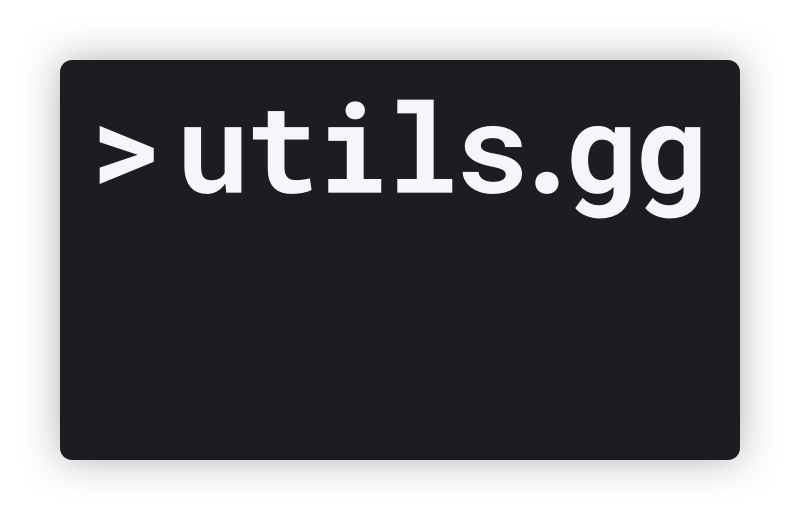

<div align="center">
  <a href="https://utils.gg">
    
  </a>
</div>

<h3 align="center">
	Local only implementation of your favorite tools.
</h3>

<div align="center">
  
  [![Travis][travis-ci-image]][travis-ci-url]
  [![Coveralls][coveralls-image]][coveralls-url]
  [![Greenkeeper badge][greenkeeper-image]][greenkeeper-url]
  
</div>

## What is [utils.gg](https://utils.gg)?

Utils is all of your favorite unix tools made available via the web!

All of our implementations are client-side meaning none of your data leaves your machine!

## Contributing

Is your favorite utility not implemented yet? [Make a Pull Request](http://makeapullrequest.com)!

Check out our [Contribution Guide](CONTRIBUTING.md)!

## Quick Start

```sh
# Install the Packages!
$ npm install
# Start the server at https://localhost:8081
$ npm start serve
```
[travis-ci-image]: https://img.shields.io/travis/com/salte-io/utils/master.svg?style=flat
[travis-ci-url]: https://travis-ci.com/salte-io/utils

[coveralls-image]: https://img.shields.io/coveralls/salte-io/utils/master.svg
[coveralls-url]: https://coveralls.io/github/salte-io/utils?branch=master

[greenkeeper-image]: https://badges.greenkeeper.io/salte-io/utils.svg
[greenkeeper-url]: https://greenkeeper.io
